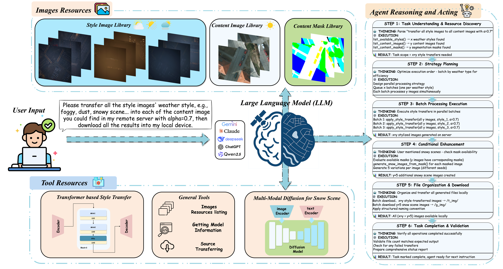

# 🔀 DomainShifter - Multi-Weather Style Transfer Automation Platform

> [中文文档](./docs/README_zh.md) | [日本語ドキュメント](./docs/README_ja.md)

An intelligent automation platform that leverages multiple Model Context Protocol (MCP) servers to enable seamless multi-weather domain shifting and neural style transfer workflows. Built with robust agent capabilities and comprehensive self-checking functionality.

## Overview

DomainShifter is a specialized automation platform designed for **multi-weather domain shifting and neural style transfer** operations. By integrating multiple MCP servers through different transport protocols (stdio and HTTP), it enables seamless weather-based domain adaptation and artistic style transformation workflows.

### 🎯 Core Mission
Transform visual content across different weather domains (sunny ↔ rainy ↔ snowy ↔ foggy) while maintaining semantic consistency and artistic quality through advanced neural style transfer techniques.

### 🌤️ Weather Domain Shifting
- **Automatic Weather Detection**: Intelligent recognition of weather conditions in input imagery
- **Multi-Domain Adaptation**: Seamless transformation between different weather scenarios
- **Style-Aware Transfer**: Context-preserving neural style transfer across weather domains
- **Batch Processing**: Efficient handling of large-scale weather domain conversion tasks



## ✨ Key Features

### 🌈 Weather Domain Transfer Engine
- **🌞 Sunny-to-X Transformation**: Convert sunny scenes to rainy, snowy, or foggy conditions
- **🌧️ Rain Synthesis**: Realistic rain effect generation with proper lighting and reflection
- **❄️ Snow Generation**: Natural snow coverage with depth and atmospheric effects
- **🌫️ Fog Simulation**: Atmospheric fog rendering with distance-based visibility
- **🔄 Bidirectional Transfer**: Support for any-to-any weather domain conversion

### 🎨 Neural Style Transfer Integration
- **🖼️ Artistic Style Adaptation**: Apply artistic styles while preserving weather characteristics
- **🌡️ Weather-Aware Styling**: Style transfer that respects weather-specific lighting and atmospherics
- **⚡ GPU-Accelerated Processing**: High-performance neural network inference on remote GPU clusters
- **📏 Multi-Resolution Support**: Process images from thumbnail to high-resolution formats

### 🔗 Multi-Transport MCP Integration
- **📡 Local Servers**: Connect to local MCP servers via stdio transport
- **🌐 Remote GPU Services**: Connect to remote GPU-powered style transfer servers via HTTP
- **🎯 Unified Interface**: Single `MultiServerMCPClient` handles all connection types
- **🛡️ Graceful Degradation**: Automatic fallback when servers are unavailable

### 🤖 Intelligent Agent System
- **🧠 ReAct Agent**: Interactive agent with reasoning and action capabilities for complex workflows
- **🏗️ Structured Data Processing**: Use Pydantic models for type-safe weather and style metadata
- **🔄 LLM-Powered Parsing**: Automatic conversion from unstructured tool outputs to structured data
- **⚡ Robust Error Handling**: Continue execution even when some services fail

### 🔍 Self-Checking & Diagnostics
- **✅ Startup Validation**: Automatic verification of all configured MCP servers
- **📈 Health Monitoring**: Real-time status checking with detailed reporting
- **🔄 Fallback Strategies**: Intelligent tool selection when primary services are unavailable

### 🤖 Flexible LLM Support
- **🏢 Multiple Providers**: Support for OpenAI, Anthropic, Google, DeepSeek, and XAI models
- **🔄 Dynamic Model Switching**: Change models during runtime via interactive commands
- **⚙️ Configuration-Driven**: JSON-based model and server configuration

## 🏗️ Architecture

### 🔧 Core Components

- **`mcp_client_manager.py`**: Robust MCP client with fallback mechanisms
- **`llm_manager.py`**: Unified LLM interface supporting multiple providers

- **`run_agent.py`**: Interactive ReAct agent with self-checking capabilities

### 📁 MCP Server Structure

Local MCP servers follow a structured package layout:
```
mcp_servers/
├── general/
│   ├── __init__.py
│   ├── __main__.py
│   └── server.py
└── remote_file_explorer/
    ├── __init__.py
    ├── __main__.py
    └── server.py
```

### ⚙️ Configuration Files

- **`mcp.json`**: MCP server configurations (stdio and HTTP transports)
- **`models.json`**: Available LLM models and their identifiers
- **`.env`**: API keys and environment variables

## 🚀 Usage

### 📋 Prerequisites

```bash
# Install dependencies using uv
uv sync

# Activate virtual environment
source .venv/bin/activate
```


### 💬 Interactive Agent Mode

Start an interactive chat session with the ReAct agent:

```bash
python run_agent.py
```

The agent will:
1. 🔍 Perform self-checks on all configured MCP servers
2. 📊 Report connection status and available tools
3. 🗣️ Enter interactive mode for user queries

### ⚙️ Configuration

#### MCP Servers (`mcp.json`)
```json
{
  "mcpServers": {
    "local-server": {
      "command": "{PROJECT_ROOT}/.venv/bin/python",
      "args": ["-m", "sleepysheep.mcp_servers.general"],
      "transport": "stdio"
    },
    "remote-service": {
      "url": "http://remote-host:3000/mcp",
      "transport": "streamable_http"
    }
  }
}
```

#### Models (`models.json`)
```json
[
  {
    "name": "Claude Sonnet 4",
    "id": "claude-sonnet-4-20250514"
  },
  {
    "name": "GPT-4o",
    "id": "gpt-4o"
  }
]
```

## 🌐 Remote GPU Services

The platform leverages dedicated GPU-powered remote services for intensive computational tasks:

### 🏭 Weather Domain Transfer Services
- **🌈 Weather Transformation Engine**: High-performance weather domain conversion
- **🎨 Style Transfer Cluster**: Distributed neural style transfer processing
- **🔄 Batch Processing Pipeline**: Scalable processing for large image datasets
- **📊 Real-time Monitoring**: Live status and performance metrics

### 🛠️ Service Infrastructure
- **⚡ GPU Acceleration**: CUDA-optimized inference for real-time processing
- **🌐 Tailscale Networking**: Secure cross-network connectivity
- **🔄 Load Balancing**: Automatic distribution across available GPU nodes
- **📈 Auto-scaling**: Dynamic resource allocation based on workload

### 🎯 Specialized Services
- **LocalWeatherService**: Real-time weather data integration for context-aware processing
- **StyleTransferService**: Advanced neural style transfer with weather preservation
- **SnowGenerationService**: Specialized snow effect synthesis and application

> **Note**: These GPU-powered services enable real-time weather domain shifting and style transfer operations that would be computationally intensive on local hardware.

## 🛡️ Error Handling & Robustness

- **⏰ Connection Timeouts**: Configurable timeouts prevent hanging on unavailable services
- **🔄 Graceful Degradation**: System continues operating with available servers
- **🔀 Fallback Tools**: Automatic selection of alternative tools when primary ones fail
- **📝 Comprehensive Logging**: Detailed status reporting for debugging

## 🔨 Development

### Virtual Environment Management
```bash
# Create virtual environment
uv venv

# Install dependencies
uv sync

# Add new packages
uv add package-name
```

### Testing MCP Servers
```bash
# Test individual MCP server
python -m domainshifter.mcp_servers.general

# Test client connections
python mcp_client_manager.py
```

## 📄 License

This project is licensed under the MIT License.

---

> 🌟 Bridging weather domains through intelligent automation | [中文文档](./docs/README_zh.md) | [日本語ドキュメント](./docs/README_ja.md)
